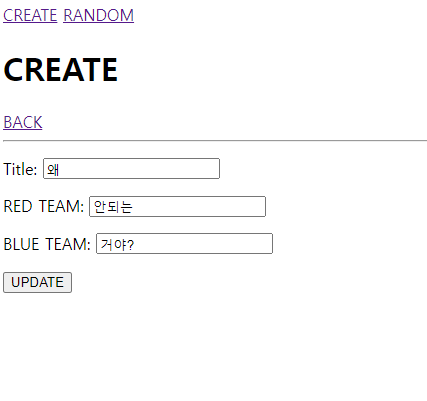
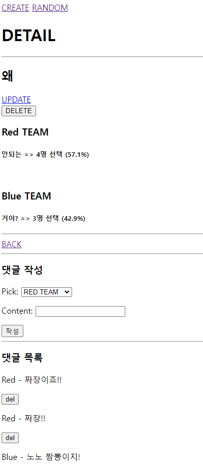

# update

urls
```py
path('<int:pk>/update', views.update, name='update'),
```
views
```py
def update(request, pk):
    either = Question.objects.get(pk=pk)
    if request.method == 'POST':
        form = QuestionForm(request.POST, instance=either)
        if form.is_valid():
            form.save()
            return redirect('eithers:detail', either.pk)
    else:
        form = QuestionForm(instance=either)
    context = {
        'either': either,
        'form': form,
    }
    return render(request, 'eithers/update.html', context)
```
html
```html
# detail.html
<a href="">UPDATE</a>

# update.html
  <h1>CREATE</h1>
  <a href="">BACK</a>
  <hr>
  <form action="" method="post">
    
    {{ form.as_p }}
    <input type="submit" value="UPDATE">
  </form>
```



# delete
urls
```py
path('<int:pk>/delete', views.delete, name='delete'),
```
views
```py
def delete(request, pk):
    if request.method == 'POST':
        either = Question.objects.get(pk=pk)
        either.delete()
    return redirect('eithers:index')
```

html
```html
  <form action="" method="post">
    
    <button>DELETE</button>
  </form>
```


# comment_delete
urls
```py
path('<int:pk>/comment/<int:comment_pk>/delete', views.comment_delete, name='comment_delete'),
```
views
```py
def comment_delete(request, pk, comment_pk):
    either = Question.objects.get(pk=pk)
    if request.method == 'POST':
        comment = Comment.objects.get(pk=comment_pk)
        comment.delete()
    return redirect('eithers:detail', either.pk)
```

detail.html
```html
<form action="" method="post">
  
  <button>del</button>
</form>
```


# count
views
```py
def detail(request, pk):
    either = Question.objects.get(pk=pk)
    comments = either.comment_set.all()
    comment_form = CommentForm()
    red_count = either.comment_set.filter(pick=0).count()
    blue_count = either.comment_set.filter(pick=1).count()
    if red_count + blue_count == 0:
        red_percent, blue_percent = '0.0', '0.0'
    else:
        red_percent = round(red_count / (red_count + blue_count) * 100, 1)
        blue_percent = round(blue_count / (red_count + blue_count) * 100, 1)
    context = {
        'either': either,
        'comment_form': comment_form,
        'comments': comments,
        'red_count': red_count,
        'blue_count': blue_count,
        'red_percent': red_percent,
        'blue_percent': blue_percent,
    }
    return render(request, 'eithers/detail.html', context)
```
detail.html
```html
  <h3>Red TEAM</h3>
  <h5>{{ either.issue_a }} => {{ red_count }}명 선택 ({{ red_percent }}%)</h5>
  <br>
  <h3>Blue TEAM</h3>
  <h5>{{ either.issue_b }} => {{ blue_count }}명 선택 ({{ blue_percent }}%)</h5>
```
