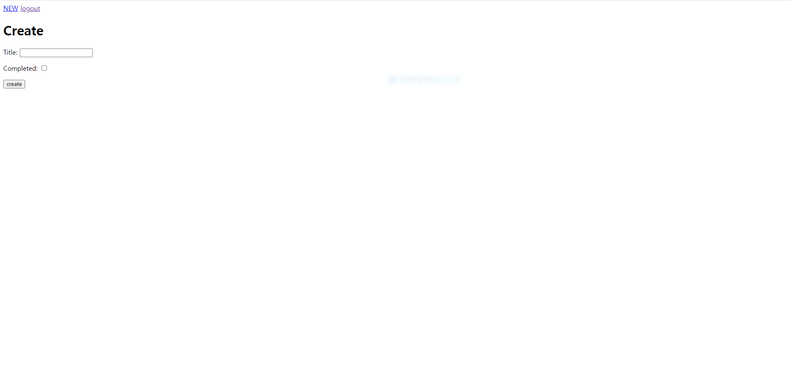

- url 추가
```py
# urls.py
from django.urls import path
from . import views

app_name = 'todos'
urlpatterns = [
    path('', views.index, name='index' ),
    path('create/', views.create, name='create'),
]
```

- models.py 정의
```py
from django.db import models
from django.conf import settings

# Create your models here.
class Todo(models.Model):
    author = models.ForeignKey(settings.AUTH_USER_MODEL, on_delete=models.CASCADE)
    title = models.CharField(max_length=100)
    completed = models.BooleanField(default=False)
```

# index
```py
from django.shortcuts import render, redirect
from .models import Todo
from .forms import TodoForm

# Create your views here.
def index(request):
    todos = Todo.objects.all()
    context = {
        'todos': todos,
    }
    return render(request, 'todos/index.html', context)

```
```html
  <h1>Todo</h1>
  <hr>
  <a href="">todo작성</a>
  <ul>
  
    <li>{{ todo.author }} - {{ todo.title }}</li>
  
     <p>작성된 글이 없습니다.</p>
  
  </ul>
```


# create
```py
def create(request):
    if request.user.is_authenticated:
        if request.method == 'POST':
            form = TodoForm(request.POST)
            if form.is_valid():
                todo = form.save(commit=False)
                todo.author = request.user
                todo.save()
                return redirect('todos:index')
        else:
            form = TodoForm()
        context = {
            'form': form,
        }
        return render(request, 'todos/create.html', context)
    else:
        return redirect('accounts:login')
```

```html
<h1>Create</h1>
  <form action="" method="post">
      
      {{ form.as_p }}
      <input type="submit" value="create">
  </form>
```


