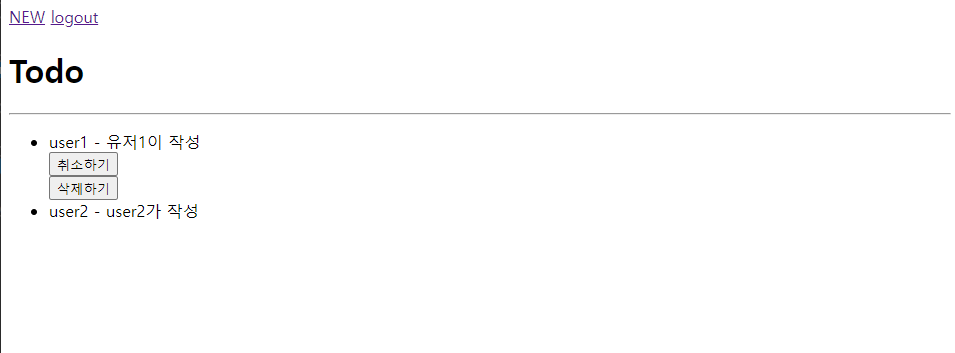
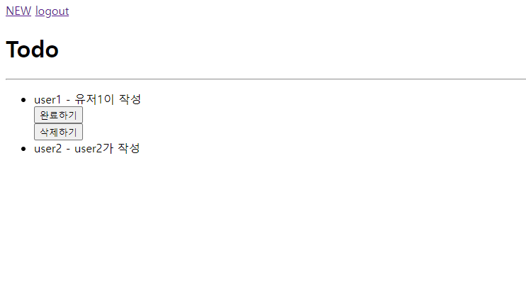
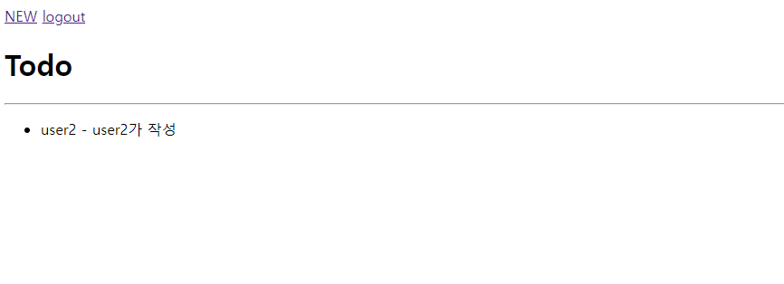

# toggle
```py
# urls.py
path('<int:pk>/', views.toggle, name='toggle'),

# views.py
def toggle(request, pk):
    todo = Todo.objects.get(pk=pk)
    if request.user.is_authenticated:
        if request.user == todo.author:
            if request.method == 'POST':
                if todo.completed:
                    todo.completed = 0
                else:
                    todo.completed = 1
                todo.save()
        return redirect('todos:index')
    else:
        return redirect('accounts:login')
```
토글



# delete
```py
# urls.py
path('<int:pk>/delete/', views.delete, name='delete'),

# views.py
def delete(request, pk):
    todo = Todo.objects.get(pk=pk)
    if request.user.is_authenticated:
        if request.user == todo.author:
            if request.method == 'POST':
                todo.delete()
        return redirect('todos:index')
    else:
        return redirect('accounts:login')
```
삭제표시

비로그인시


index.html
```html
  <ul>
  
    <li>{{ todo.author }} - {{ todo.title }}</li>
    
      <form action="" method="post">
        
        
          <input type="submit" value="취소하기">
        
          <input type="submit" value="완료하기">
        
      </form>
      <form action="" method="post">
        
        <input type="submit" value="삭제하기">
      </form>
    
  
     <p>작성된 글이 없습니다.</p>
  
  </ul>
```