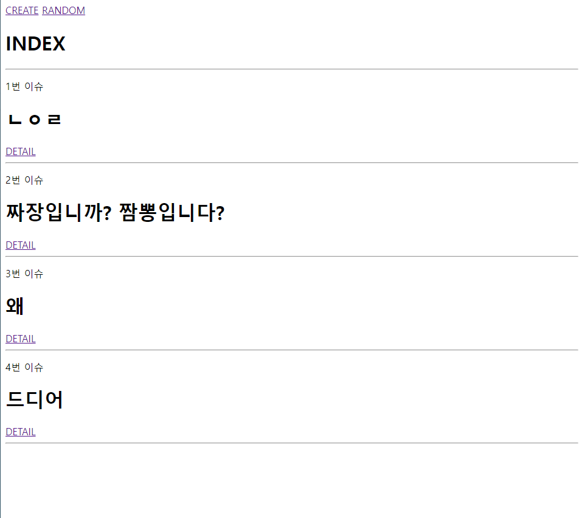
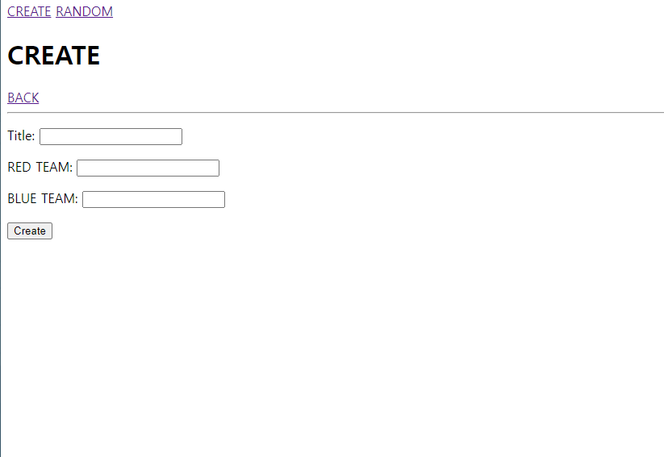
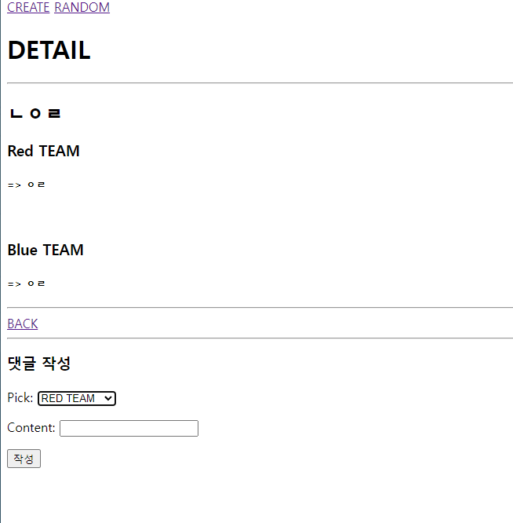
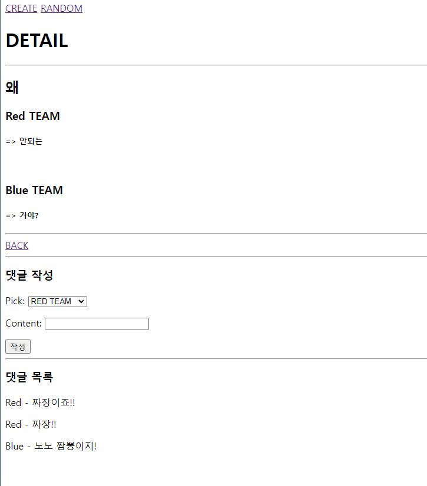

# Question

model
```py
class Question(models.Model):
    title = models.CharField(max_length=200)
    issue_a = models.CharField(max_length=100)
    issue_b = models.CharField(max_length=100)
```

forms
```py
class QuestionForm(forms.ModelForm):
    issue_a = forms.CharField(label="RED TEAM")
    issue_b = forms.CharField(label="BLUE TEAM")
    class Meta:
        model = Question
        fields = '__all__'
```

urls
```py
    path('', views.index, name='index'),
    path('create', views.create, name='create'),
    path('<int:pk>', views.detail, name='detail'),
```
views
```py
# index
def index(request):
    eithers = Question.objects.all()
    context = {
        'eithers': eithers,
    }
    return render(request, 'eithers/index.html', context)

# create
def create(request):
    if request.method == 'POST':
        form = QuestionForm(request.POST)
        if form.is_valid():
            detail = form.save()
            return redirect('eithers:detail', detail.pk)
    else:
        form = QuestionForm()
    context = {
        'form': form,
    }
    return render(request, 'eithers/create.html', context)

# detail
def detail(request, pk):
    either = Question.objects.get(pk=pk)
    comments = either.comment_set.all()
    comment_form = CommentForm()
    context = {
        'either': either,
        'comment_form': comment_form,
        'comments': comments,
    }
    return render(request, 'eithers/detail.html', context)
```

# Comment
model
```py
class Comment(models.Model):
    question = models.ForeignKey(Question, on_delete=models.CASCADE)
    pick = models.BooleanField(default=False)
    content = models.CharField(max_length=100)
```

forms
```py
class CommentForm(forms.ModelForm):
    TEAM_A = '0'
    TEAM_B = '1'
    TEAM_CHOICES = [
        (TEAM_A, 'RED TEAM'),
        (TEAM_B, 'BLUE TEAM'),
    ]
    pick = forms.ChoiceField(choices=TEAM_CHOICES)

    class Meta:
        model = Comment
        exclude = ['question',]
```

urls
```py
    path('<int:pk>/comment', views.comment, name='comment'),
    path('random_page/', views.random_page, name='random_page'),
```

views
```py
def comment(request, pk):
    either = Question.objects.get(pk=pk)
    if request.method == 'POST':
        comment_form = CommentForm(request.POST)
        if comment_form.is_valid():
            comment_create = comment_form.save(commit=False)
            comment_create.question = either
            comment_create.save()
            return redirect('eithers:detail', either.pk)
```

# random
```py
def random_page(request):
    question = Question.objects.values('pk')
    pk_lst = []
    for value in question:
        pk_lst.append(value)
    selected_pk = random.choice(pk_lst).get('pk')
    return redirect('eithers:detail', selected_pk)
```


index html
```html
  <h1>INDEX</h1>
  <hr>
  
    <p>{{ either.pk }}번 이슈</p>
    <h1>{{ either.title }} </h1>
    <a href="">DETAIL</a>
    <hr>
  
```


create html
```html
  <h1>CREATE</h1>
  <a href="">BACK</a>
  <hr>
  <form action="" method="post">
    
    {{ form.as_p }}
    <input type="submit" value="Create">
  </form>
```


detail html
```html
  <h1>DETAIL</h1>
  <hr>
  <h2>{{ either.title }}</h2>
  <h3>Red TEAM</h3>
  <h5>=> {{ either.issue_a }}</h5>
  <br>
  <h3>Blue TEAM</h3>
  <h5>=> {{ either.issue_b }}</h5>
  <hr>
  <a href="">BACK</a>
  <hr>
  <h3>댓글 작성</h3>
  <form action="" method="post">
    
    {{ comment_form.as_p }}
    <input type="submit" value="작성">
  </form>
  
    <hr>
    <h3>댓글 목록</h3>
    
      
        <p>Blue - {{ comment.content }}</p>
      
        <p>Red - {{ comment.content }}</p>
      
    
  

  
```

